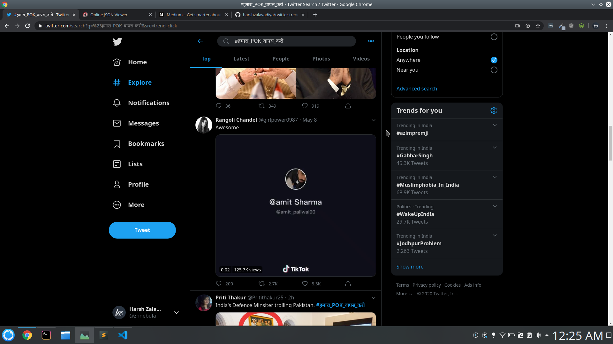
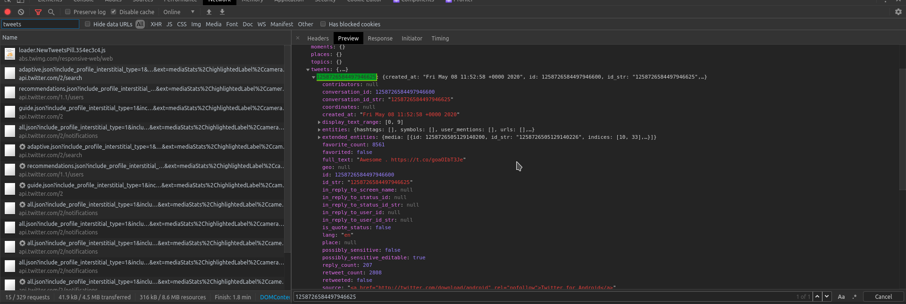

# Totally unrelated video in trend

Totally unrelated video in trend `#हमारा_POK_वापस_करो` that suddenly went viral because showing up in top tweets for this trend though it was posted a day before this hashtag went viral



It's really simple to reverse engineer twitter's payload for tweets as it's just clean json object containing tweet IDs and then ultimately data that renders your tweet.



Above is the trend response of that tweet in a photo proof

Since I'm viewing trend that is mostly related with hashtag this [tweet](https://twitter.com/girlpower0987/status/1258726584497946625) should atleast have partial text or matching hashtag but below was the tweet payload

```json
{
  "created_at": "Fri May 08 11:52:58 +0000 2020",
  "id": 1258726584497946625,
  "id_str": "1258726584497946625",
  "full_text": "Awesome . https://t.co/goaOIbT3Je",
  "truncated": false,
  "display_text_range": [0, 9],
  "entities": {
    "hashtags": [],
    "symbols": [],
    "user_mentions": [],
    "urls": [],
    "media": [
      {
        "id": 1258726505129140226,
        "id_str": "1258726505129140226",
        "indices": [10, 33],
        "media_url": "http://pbs.twimg.com/ext_tw_video_thumb/1258726505129140226/pu/img/Q3VnLLqMqWxtCysP.jpg",
        "media_url_https": "https://pbs.twimg.com/ext_tw_video_thumb/1258726505129140226/pu/img/Q3VnLLqMqWxtCysP.jpg",
        "url": "https://t.co/goaOIbT3Je",
        "display_url": "pic.twitter.com/goaOIbT3Je",
        "expanded_url": "https://twitter.com/girlpower0987/status/1258726584497946625/video/1",
        "type": "photo",
        "original_info": {
          "width": 608,
          "height": 540
        },
        "sizes": {
          "medium": {
            "w": 608,
            "h": 540,
            "resize": "fit"
          },
          "thumb": {
            "w": 150,
            "h": 150,
            "resize": "crop"
          },
          "small": {
            "w": 608,
            "h": 540,
            "resize": "fit"
          },
          "large": {
            "w": 608,
            "h": 540,
            "resize": "fit"
          }
        },
        "features": {}
      }
    ]
  },
  "extended_entities": {
    "media": [
      {
        "id": 1258726505129140226,
        "id_str": "1258726505129140226",
        "indices": [10, 33],
        "media_url": "http://pbs.twimg.com/ext_tw_video_thumb/1258726505129140226/pu/img/Q3VnLLqMqWxtCysP.jpg",
        "media_url_https": "https://pbs.twimg.com/ext_tw_video_thumb/1258726505129140226/pu/img/Q3VnLLqMqWxtCysP.jpg",
        "url": "https://t.co/goaOIbT3Je",
        "display_url": "pic.twitter.com/goaOIbT3Je",
        "expanded_url": "https://twitter.com/girlpower0987/status/1258726584497946625/video/1",
        "type": "video",
        "original_info": {
          "width": 608,
          "height": 540
        },
        "sizes": {
          "medium": {
            "w": 608,
            "h": 540,
            "resize": "fit"
          },
          "thumb": {
            "w": 150,
            "h": 150,
            "resize": "crop"
          },
          "small": {
            "w": 608,
            "h": 540,
            "resize": "fit"
          },
          "large": {
            "w": 608,
            "h": 540,
            "resize": "fit"
          }
        },
        "video_info": {
          "aspect_ratio": [152, 135],
          "duration_millis": 17033,
          "variants": [
            {
              "bitrate": 2176000,
              "content_type": "video/mp4",
              "url": "https://video.twimg.com/ext_tw_video/1258726505129140226/pu/vid/608x540/4bHLluPcQM20JT59.mp4?tag=10"
            },
            {
              "bitrate": 256000,
              "content_type": "video/mp4",
              "url": "https://video.twimg.com/ext_tw_video/1258726505129140226/pu/vid/304x270/vehLe3LV_tPJ2TqH.mp4?tag=10"
            },
            {
              "bitrate": 832000,
              "content_type": "video/mp4",
              "url": "https://video.twimg.com/ext_tw_video/1258726505129140226/pu/vid/404x360/1EKV4GAF122rXnrW.mp4?tag=10"
            },
            {
              "content_type": "application/x-mpegURL",
              "url": "https://video.twimg.com/ext_tw_video/1258726505129140226/pu/pl/5JV28iiupTr2fs_r.m3u8?tag=10"
            }
          ]
        },
        "features": {},
        "media_key": "7_1258726505129140226",
        "ext_media_availability": {
          "status": "available"
        },
        "ext_alt_text": null,
        "ext_media_color": null,
        "ext": {
          "mediaStats": {
            "r": {
              "ok": {
                "viewCount": "125704"
              }
            },
            "ttl": -1
          }
        },
        "additional_media_info": {
          "monetizable": false
        }
      }
    ]
  },
  "source": "\u003ca href=\"http://twitter.com/download/android\" rel=\"nofollow\"\u003eTwitter for Android\u003c/a\u003e",
  "in_reply_to_status_id": null,
  "in_reply_to_status_id_str": null,
  "in_reply_to_user_id": null,
  "in_reply_to_user_id_str": null,
  "in_reply_to_screen_name": null,
  "user_id": 1227225786643439616,
  "user_id_str": "1227225786643439616",
  "geo": null,
  "coordinates": null,
  "place": null,
  "contributors": null,
  "is_quote_status": false,
  "retweet_count": 2716,
  "favorite_count": 8276,
  "reply_count": 200,
  "conversation_id": 1258726584497946625,
  "conversation_id_str": "1258726584497946625",
  "favorited": false,
  "retweeted": false,
  "possibly_sensitive": false,
  "possibly_sensitive_editable": true,
  "lang": "en",
  "supplemental_language": null
}
```

lookout for the response with key `hashtags` it's blank but if you check other tweets on full json response you will be able to find encoded tag `\u0939\u092e\u093e\u0930\u093e_POK_\u0935\u093e\u092a\u0938_\u0915\u0930\u094b`

I went through every post on that payload looking for similarity of having no hashtags but found none

by the time I wrote this report that tweet has gone wild and had ~8K+ likes from ~2K+ within ~1hour and ironically post is one day long

### TL;DR

- Why this tweet is the only one has no hashtag relating to trend
- This tweet does not say promoted anywhere otherwise it's acceptable
- Even if tweet has hashtag in comment section is it okay for twitter to just show main tweet without relating comment (I guess twitter doesn't do this AFAIK)
