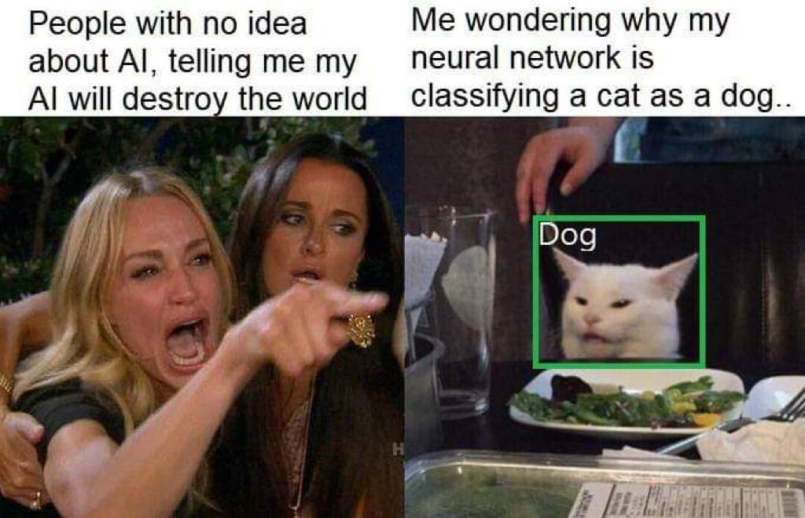

# Investigation on Trends data being manuplated/errored by Twitter India

COVID-19 is very critical time and also an opportunity for politicians or individuals to manuplate people's minds and an income opportunity for social media platforms to earn a lot of money or might be just carelessness or lack of framework to fact check on what their employees are doing.

I don't want twitter to become another Facebook and think someone should take necessary steps before there's no going back.

I don't consider myself as expert/hacker of anything that cool kids like to say nowadays 😃, and there's high possiblity that I might look like an dummy after this not knowing obvious facts but I tend to ask questions even if I make complete fool out of myself 😅

### Disclaimer

- This is just some insights and thoughts, they might be proven wrong or justified by twitter but unless someone is ready to answer this questions they will always be an mistory for me and a reason not to trust
- This repository is NOT to endorse or blame any political party in india in any way please refrain attaching my name to any political party
- There's also an chance that someone's ML at scale might just be going wild and if so someout should fix it ASAP 😂

### Investigations

- [Totally unrelated video in trend](./media/README.md)
- [Some more Proofs take on Mobile devices](https://github.com/harshzalavadiya/twitter-trend-manipulation/tree/master/00_mobile-proofs)

### How this started

It was saturday, and decided to take a break from work stuff and do almost nothing and decided to browse twitter to see what's going on in the whold india but while browsing trends suddenly my eyes just stopped at a tweet having and notified my mind saying wait a minute that isn't related to this trend at all. comments must have something related to this hastag then, but was left amused when no comment had anything relatd to this at all, I took a screenshot on my phone and thought let's refresh this and see if it comes up, but nope just wasn't there

I assured myself saying that just some glitch due to our "award winning slow" WI-FI connection and just continued to browse twitter, after some time I saw this happening agin this time I was on my iPad and already prepared to screen-recoard. so I started taking videos showing comments even so that can prove that no comment is closely related to ongoing trend.

First of all like a good person does I did some tweets to `@TwitterSupport`, `@TwitterIndia` and `@EFF` etc. in hope for answer but as everybody knows nobody takes just a random guy seriously and was no response from bunch of others as well. so I decided to inspect payloads on twitter web and found the same so I decided to write this report just to put it out there in hope of answers with some report that makes sense for devs/general people out there that this seems wrong and somebody should ask hard questions and so here it is in hope of someone might provide some explanation/or some foundation or media that cares for digital privacy will decide to take it to bigger audiance.

**by Harsh Zalavadiya (a concerned citizen, a proud indian 🇮🇳)**

### Memes (because why not?)

